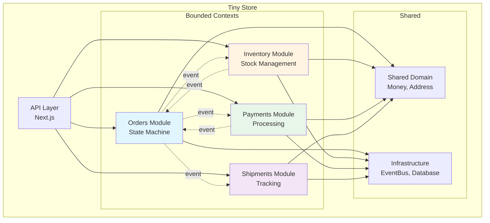
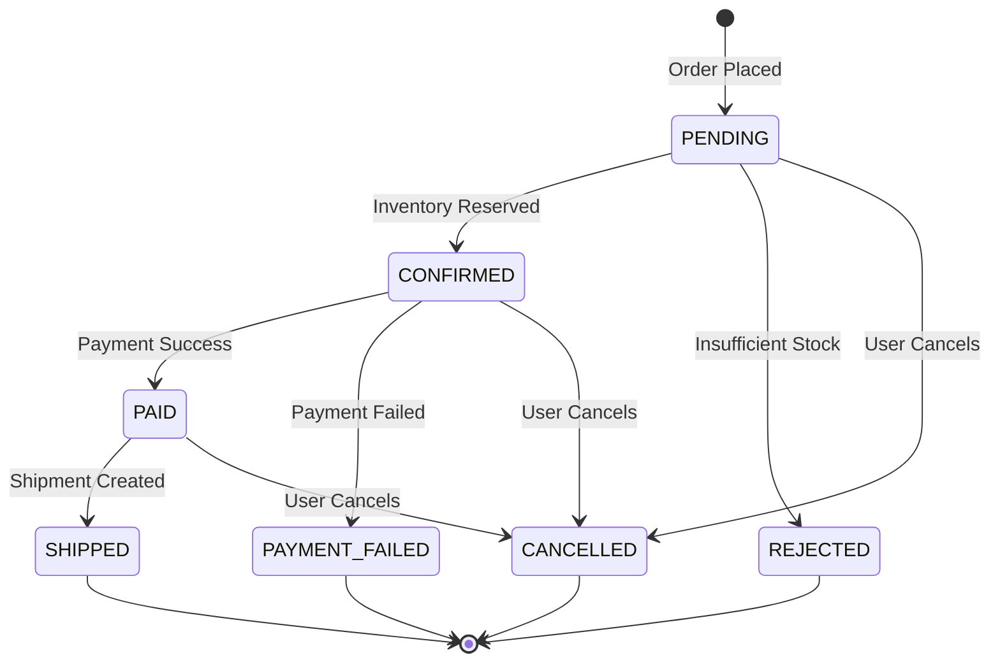
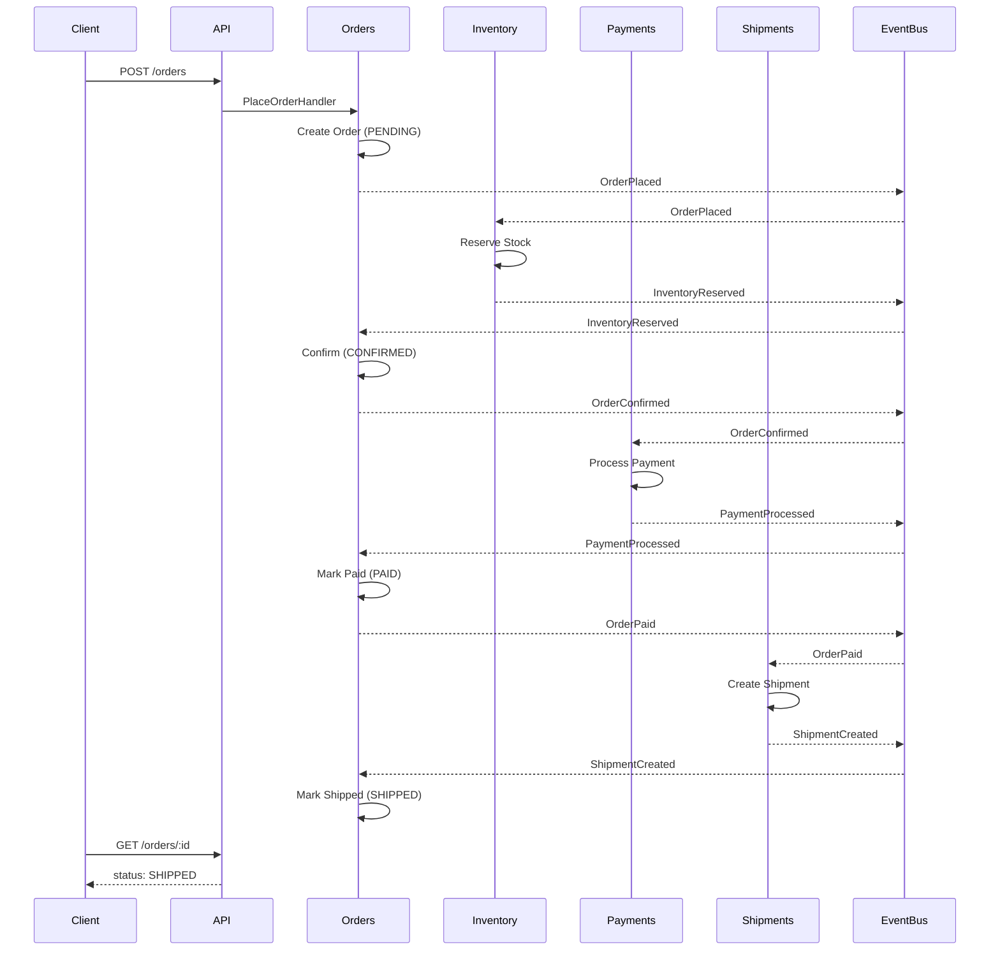

# Tiny Store

<div align="center">


A modular monolith demonstrating Domain-Driven Design, event-driven architecture, and clean separation of concerns for an e-commerce order management system.

[Features](#key-features) • [Quick Start](#quick-start) • [Documentation](#documentation) • [Contributing](#contributing) • [Research](#-academic-research-context)

</div>

## Overview

Tiny Store is a research project implementing a complete order lifecycle with:
- **4 bounded contexts** (Orders, Inventory, Payments, Shipments)
- **Event-driven communication** between modules
- **Rich domain models** with business logic
- **310+ tests** including architecture enforcement
- **Complete REST API** for all operations



## Quick Start

### Prerequisites
- Node.js 18+
- npm

### Installation

```bash
# Clone and install
git clone <repository>
cd tiny-store
npm install
```

### Running the Application

```bash
# Development server
npm run dev

# Production build
npm run build
```

**Server runs at:** `http://localhost:3000`

### Running Tests

```bash
# All tests
npm test

# Specific categories
npm run test:unit          # Domain logic tests
npm run test:boundary      # Architecture enforcement
npm run test:integration   # Event flow tests

# E2E tests (requires server running)
npm run dev                # Terminal 1
npm run test:e2e:api      # Terminal 2 - API tests
npm run test:e2e:perf     # Terminal 2 - Performance tests

# Coverage
npm run test:coverage
```

## Project Structure

```
tiny-store/
├── apps/api/                          # HTTP API (Next.js 15)
│   └── src/app/
│       ├── api/                       # REST endpoints
│       │   ├── orders/
│       │   ├── inventory/
│       │   └── events/
│       └── lib/                       # Infrastructure setup
│           ├── database.ts            # TypeORM connection
│           ├── event-bus.ts           # Event bus singleton
│           └── register-listeners.ts  # Wire event handlers
│
├── libs/modules/                      # Bounded contexts
│   ├── orders/
│   │   └── src/
│   │       ├── domain/
│   │       │   ├── entities/          # Order aggregate
│   │       │   ├── value-objects/     # OrderItem, CustomerId
│   │       │   ├── events/            # 7 domain events
│   │       │   └── repositories/      # OrderRepository
│   │       ├── features/              # Use cases (vertical slices)
│   │       │   ├── place-order/
│   │       │   ├── get-order/
│   │       │   ├── list-orders/
│   │       │   └── cancel-order/
│   │       └── listeners/             # Event handlers
│   ├── inventory/                     # Similar structure
│   ├── payments/                      # Similar structure
│   └── shipments/                     # Similar structure
│
├── libs/shared/
│   ├── domain/                        # Base classes
│   │   ├── base/                      # Entity, AggregateRoot
│   │   ├── value-objects/             # Money, Address
│   │   ├── errors/                    # Domain errors
│   │   └── result/                    # Result<T, E> type
│   ├── infrastructure/                # Shared infrastructure
│   │   ├── event-bus/                 # In-memory pub/sub
│   │   ├── event-store/               # Append-only log
│   │   └── database/                  # TypeORM setup
│   └── testing/                       # Test utilities
│       └── src/
│           ├── test-helpers.ts        # TestDatabase, EventBusSpy
│           ├── module-boundary.spec.ts # Architecture tests
│           └── event-flow.integration.spec.ts
│
├── docs/
│   ├── ARCHITECTURE.md                # Design decisions
│   ├── API.md                         # Endpoint reference
│   ├── EVENT_FLOWS.md                 # Event choreography
│   └── TESTING.md                     # Testing guide
│
└── test-api.js                        # Standalone E2E tests
```

## Order Lifecycle



**State Transitions:**
1. **PENDING** - Order created, awaiting inventory check
2. **CONFIRMED** - Inventory reserved, ready for payment
3. **REJECTED** - Insufficient stock
4. **PAID** - Payment successful
5. **PAYMENT_FAILED** - Payment declined
6. **SHIPPED** - Shipment created and dispatched
7. **CANCELLED** - User cancelled order

## Event Flow Example

Complete happy path from order to shipment:



## Key Features

### 1. Module Boundaries
Modules communicate **only** through events:

```typescript
// ✅ Allowed
import { PlaceOrderHandler } from '@tiny-store/modules-orders';
eventBus.subscribe('OrderPlaced', handler);

// ❌ Blocked by architecture
import { Order } from '@tiny-store/modules-orders'; // Entity not exported
import { OrderRepository } from '@tiny-store/modules-orders'; // Not exported
```

**Enforced by:** 20 boundary tests verify architectural rules.

### 2. Rich Domain Models

Business logic lives in domain entities, not controllers:

```typescript
class Order extends AggregateRoot {
  confirm(): void {
    if (this.status !== OrderStatus.PENDING) {
      throw new BusinessRuleViolationError('Only pending orders can be confirmed');
    }
    this.status = OrderStatus.CONFIRMED;
    this.addDomainEvent(createOrderConfirmedEvent(this.id));
  }
  
  cancel(): void {
    if (this.status === OrderStatus.SHIPPED) {
      throw new BusinessRuleViolationError('Cannot cancel shipped orders');
    }
    this.status = OrderStatus.CANCELLED;
    this.addDomainEvent(createOrderCancelledEvent(this.id));
  }
}
```

### 3. Event-Driven Architecture

13 event types orchestrate the system:

```typescript
// Orders publishes
eventBus.publish(createOrderPlacedEvent(order));

// Inventory listens and reacts
eventBus.subscribe('OrderPlaced', async (event) => {
  await reserveStockHandler.handle(event);
});
```

### 4. Type-Safe Error Handling

Result type for functional error handling:

```typescript
const result = Money.create(100, 'USD');

if (result.isSuccess()) {
  const money = result.getValue();
  console.log(money.amount); // 100
} else {
  const error = result.getError();
  console.log(error.message); // "Invalid currency"
}
```

## API Examples

### Create Product

```bash
curl -X POST http://localhost:3000/api/inventory/products \
  -H "Content-Type: application/json" \
  -d '{
    "sku": "WIDGET-001",
    "name": "Super Widget",
    "price": 99.99,
    "currency": "USD",
    "stockQuantity": 100
  }'
```

### Place Order

```bash
curl -X POST http://localhost:3000/api/orders \
  -H "Content-Type: application/json" \
  -d '{
    "customerId": "customer-123",
    "items": [{
      "sku": "WIDGET-001",
      "quantity": 2,
      "unitPrice": 99.99,
      "currency": "USD"
    }],
    "shippingAddress": {
      "street": "123 Main St",
      "city": "Springfield",
      "state": "IL",
      "postalCode": "62701",
      "country": "USA"
    }
  }'
```

### Check Order Status

```bash
# Get specific order
curl http://localhost:3000/api/orders/{orderId}

# List all orders
curl http://localhost:3000/api/orders

# Filter by status
curl http://localhost:3000/api/orders?status=PAID
```

### Query Event History

```bash
# All events
curl http://localhost:3000/api/events

# Events for specific order
curl http://localhost:3000/api/events?aggregateId={orderId}

# Specific event type
curl http://localhost:3000/api/events?eventType=OrderPlaced
```

See [docs/API.md](./docs/API.md) for complete API reference.

## Testing

### Test Coverage

| Category | Tests | Purpose |
|----------|-------|---------|
| **Unit Tests** | ~150 | Domain logic validation |
| **Boundary Tests** | 20 | Architecture enforcement |
| **Integration Tests** | 35 | Event flow scenarios |
| **API Tests** | 80+ | HTTP endpoint coverage |
| **Performance Tests** | 25 | Load & concurrency |
| **TOTAL** | **310+** | **Complete coverage** |

### Example Tests

**Unit Test - Domain Logic:**
```typescript
it('should not allow cancellation after shipment', () => {
  const order = Order.create(/* ... */);
  order.markAsShipped();
  
  expect(() => order.cancel()).toThrow(BusinessRuleViolationError);
});
```

**Boundary Test - Architecture:**
```typescript
it('should NOT allow Orders module to import Inventory entities', () => {
  let importFailed = false;
  
  try {
    const inventory = require('@tiny-store/modules-inventory');
    const Product = inventory.Product; // Should not exist
    importFailed = false;
  } catch (error) {
    importFailed = true; // Expected
  }
  
  expect(importFailed).toBe(true);
});
```

**Integration Test - Event Flow:**
```typescript
it('should complete full order lifecycle', async () => {
  await createProduct({ sku: 'TEST-001', stockQuantity: 100 });
  
  const order = await placeOrder({ sku: 'TEST-001', quantity: 5 });
  await waitForEvents(500);
  
  const updatedOrder = await getOrder(order.orderId);
  expect(['CONFIRMED', 'PAID', 'SHIPPED']).toContain(updatedOrder.status);
});
```

See [docs/TESTING.md](./docs/TESTING.md) for complete testing guide.

## Tech Stack

| Layer | Technology |
|-------|-----------|
| **Runtime** | Node.js 18+ |
| **Language** | TypeScript (strict mode) |
| **Framework** | Next.js 15 (App Router) |
| **Monorepo** | Nx |
| **Database** | SQLite + TypeORM |
| **Event Bus** | In-memory pub/sub |
| **Testing** | Jest |

## Documentation

- **[ARCHITECTURE.md](./docs/ARCHITECTURE.md)** - Design principles and patterns
- **[API.md](./docs/API.md)** - Complete endpoint reference with examples
- **[EVENT_FLOWS.md](./docs/EVENT_FLOWS.md)** - Event choreography and diagrams
- **[TESTING.md](./docs/TESTING.md)** - Testing strategy and examples

## Project Goals

This project demonstrates:

1. **Modular Monolith** - Clear boundaries without microservices complexity
2. **Domain-Driven Design** - Rich models, value objects, aggregates
3. **Event-Driven Architecture** - Loose coupling via domain events
4. **Vertical Slice Architecture** - Features organized by capability
5. **Test-Driven Development** - 310+ tests with architecture enforcement
6. **Type Safety** - Strict TypeScript with business types
7. **Clean Architecture** - Separation of concerns across layers

## What This Is NOT

- ❌ Production-ready e-commerce platform
- ❌ Microservices example
- ❌ Real payment processing
- ❌ Authentication/authorization system
- ❌ Horizontally scalable architecture

This is a **research project** focused on DDD patterns and modular monolith architecture.

## Future Enhancements

If building for production:

- [ ] External message broker (RabbitMQ/Kafka)
- [ ] PostgreSQL for production database
- [ ] Redis for caching
- [ ] Authentication and authorization
- [ ] Real payment gateway integration
- [ ] Distributed tracing
- [ ] API rate limiting
- [ ] Circuit breakers
- [ ] Monitoring and alerting
- [ ] CI/CD pipeline

## License

MIT

## Contributing

We welcome contributions! This is a research project focused on demonstrating best practices in modular monolith architecture, Domain-Driven Design, and event-driven systems. Your contributions help advance the understanding of these architectural patterns.

### 🤝 How to Contribute

**Ways you can contribute:**

1. **🐛 Report Bugs** - Found an issue? Open an issue with detailed information
2. **💡 Suggest Features** - Have ideas for improvements? Share them!
3. **📝 Improve Documentation** - Help make the docs clearer and more comprehensive
4. **🧪 Add Tests** - Increase test coverage or add new test scenarios
5. **🔧 Code Contributions** - Submit pull requests for bug fixes or enhancements
6. **📚 Share Knowledge** - Write blog posts, tutorials, or examples using this project

### 🚀 Getting Started

1. **Fork the repository** and clone your fork
2. **Create a branch** for your contribution (`git checkout -b feature/amazing-feature`)
3. **Make your changes** following the project's architecture patterns
4. **Run tests** to ensure everything works (`npm test`)
5. **Commit your changes** with clear, descriptive messages
6. **Push to your fork** and open a Pull Request

### 📋 Contribution Guidelines

- **Follow the architecture** - Maintain module boundaries and event-driven communication
- **Write tests** - New features should include appropriate tests
- **Update documentation** - Keep docs in sync with code changes
- **Respect boundaries** - Don't break module isolation rules
- **Be descriptive** - Clear commit messages and PR descriptions help reviewers

### 🎯 Areas for Contribution

- **Performance improvements** - Optimize event handling or database queries
- **Additional bounded contexts** - Implement new modules following the existing patterns
- **Testing utilities** - Enhance test helpers and fixtures
- **Documentation** - Improve guides, add examples, or clarify concepts
- **Code quality** - Refactoring, type safety improvements, or linting fixes

### 📖 Research Context

This project is part of academic research. If you're contributing code or ideas that relate to the research objectives, please reference the [academic section](#-academic-research-context) and consider citing the published paper if you use this work in your own research.

### ❓ Questions?

Feel free to open an issue with questions or reach out to discuss ideas before implementing major changes.

---

**Thank you for contributing! 🙏**

**Built with ❤️ to demonstrate modular monolith architecture and DDD for cloud-native applications**

---

## 🎓 Academic Research Context

<div align="center">
  
  
  ### Instituto Tecnológico de Aeronáutica (ITA)
  **Master's Degree in Computing Engineering**  
  *Distributed Systems and Software Engineering*
</div>

---

This project is part of academic research investigating the practical application of Domain-Driven Design (DDD) patterns and modular monolith architectures in event-driven systems. The work explores how to maintain strong module boundaries while achieving the benefits of event-driven communication within a monolithic architecture.

### 📄 Publication

This research has been published and presented at:

**Conference:** [WEBIST 2025](https://www.insticc.org/node/TechnicalProgram/webist/2025/presentationDetails/137868) - 20th International Conference on Web Information Systems and Technologies  
**Paper ID:** 137868  
**Publisher:** SCITEPRESS - Science and Technology Publications  
**Year:** 2025  
**Organized by:** INSTICC - Institute for Systems and Technologies of Information, Control and Communication

**Authors:**
- **Maurício Carvalho** - Department of Computing Science, Instituto Tecnológico de Aeronáutica (ITA), São José dos Campos, Brazil
- **Juliana de Melo Bezerra** - Department of Computing Science, Instituto Tecnológico de Aeronáutica (ITA), São José dos Campos, Brazil
- **Karla Donato Fook** - Department of Computing Science, Instituto Tecnológico de Aeronáutica (ITA), São José dos Campos, Brazil

**Links:**
- [Full Paper (PDF)](https://www.scitepress.org/Papers/2025/137868/137868.pdf)
- [Conference Presentation Details](https://www.insticc.org/node/TechnicalProgram/webist/2025/presentationDetails/137868)

#### Abstract

Cloud-native software startups face intense pressure from limited resources, high uncertainty, and the need for rapid validation. In this context, early architectural decisions have lasting effects on scalability, maintainability, and adaptability. Although microservices are often favored for their modularity, they introduce significant operational overhead and require organizational maturity that many startups lack. Traditional monoliths offer simplicity but tend to evolve into rigid, tightly coupled systems. When designed with disciplined modularity, modular monoliths can offer internal boundaries that support sustainable growth while avoiding the fragmentation and complexity of premature microservices adoption. The existing literature emphasizes microservices, leaving gaps in guidance for modular monoliths on topics like modularization, scalability, onboarding, and deployment. This paper proposes guidelines for designing scalable modular monoliths, maintaining architectural flexibility, and reducing complexity, thereby supporting long-term evolution under typical startup constraints. The initial category of guidelines is presented, and their intended structure is thoroughly outlined.

**Keywords:** Software Engineering, Software Architecture, Cloud Computing, Modular Monolith, Microservices.

### 👨‍🏫 Research Advisors

This research was conducted under the guidance of:
- **Prof. Juliana de Melo Bezerra, PhD** - Department of Computing Science, Instituto Tecnológico de Aeronáutica (ITA)
- **Prof. Karla Donato Fook, PhD** - Department of Computing Science, Instituto Tecnológico de Aeronáutica (ITA)

### 🎯 Research Objectives

This research addresses the gap in literature regarding modular monoliths by proposing guidelines for:

1. **Designing Scalable Modular Monoliths** - Establishing architectural patterns that support sustainable growth under startup constraints
2. **Maintaining Architectural Flexibility** - Creating internal boundaries that enable future evolution without premature microservices adoption
3. **Reducing Complexity** - Balancing modularity with operational simplicity to avoid the overhead of distributed systems
4. **Supporting Long-term Evolution** - Providing guidance on modularization, scalability, onboarding, and deployment strategies
5. **Practical Implementation** - Demonstrating real-world application through this codebase, which implements DDD patterns, event-driven architecture, and module boundary enforcement

This codebase serves as a practical demonstration of the guidelines proposed in the research paper.

### 📚 Citation

If you use this project or reference this research, please cite:

```bibtex
@inproceedings{carvalho2025modular,
  title={Guidelines for Designing Scalable Modular Monoliths: Supporting Long-term Evolution in Cloud-native Startups},
  author={Carvalho, Maur{\'i}cio and Bezerra, Juliana de Melo and Fook, Karla Donato},
  booktitle={Proceedings of the 20th International Conference on Web Information Systems and Technologies (WEBIST 2025)},
  year={2025},
  publisher={SCITEPRESS - Science and Technology Publications},
  pages={137868},
  url={https://www.scitepress.org/Papers/2025/137868/137868.pdf}
}
```

**Conference:** WEBIST 2025 - 20th International Conference on Web Information Systems and Technologies  
**Organized by:** INSTICC - Institute for Systems and Technologies of Information, Control and Communication

### 🏛️ About ITA

The Instituto Tecnológico de Aeronáutica (ITA) is a prestigious Brazilian engineering institution affiliated with the Brazilian Air Force, specializing in aerospace and advanced engineering education and research.
