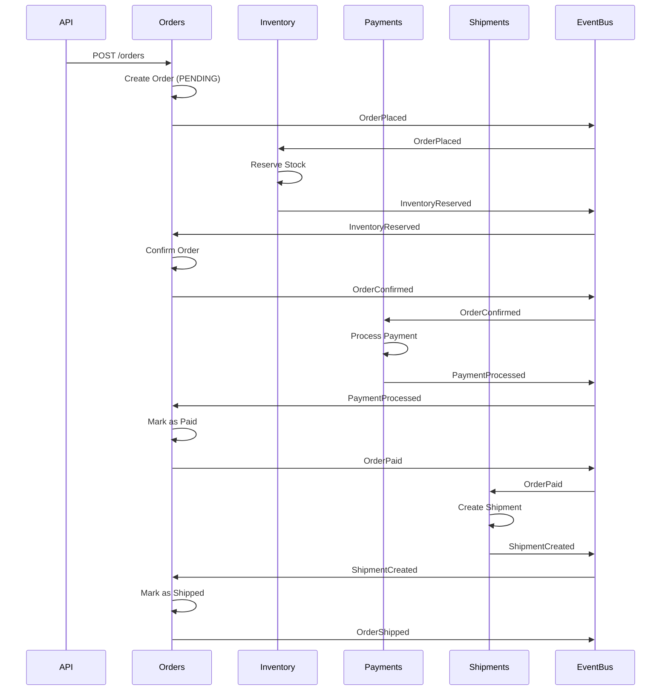
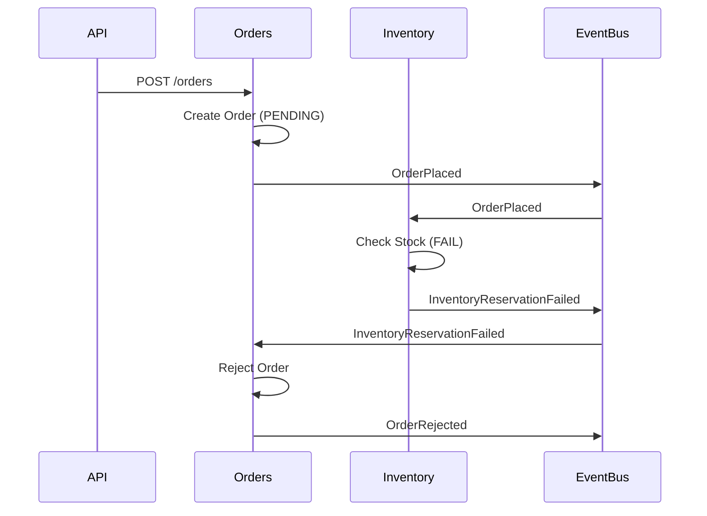
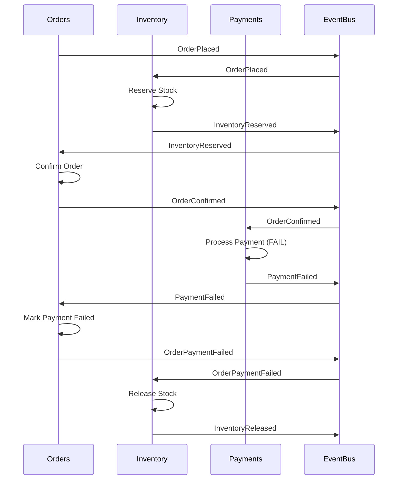
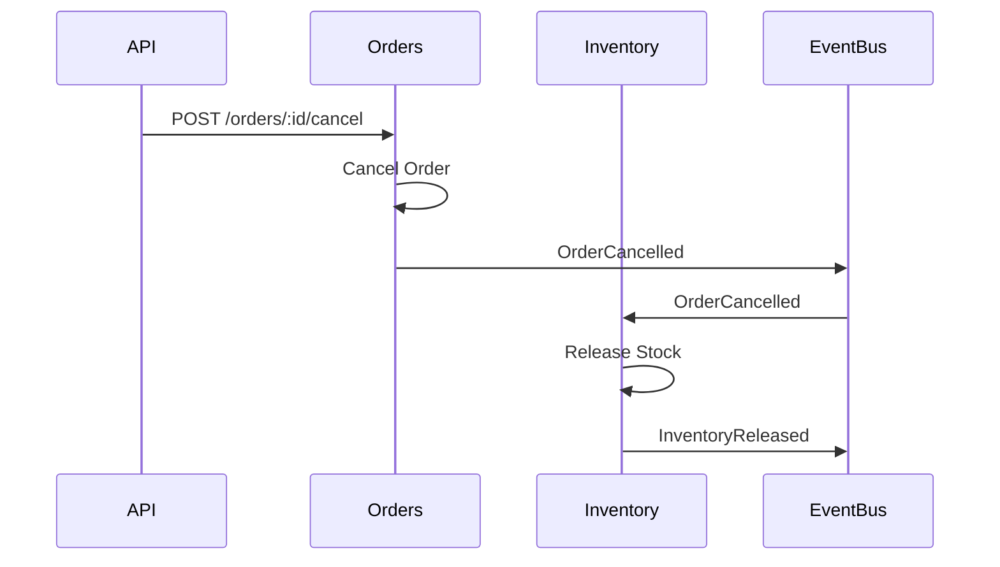

# Event Flows

Event choreography for the Tiny Store order management system.

## Overview

Modules communicate asynchronously via domain events. Each module:
- Publishes events when state changes
- Subscribes to events from other modules
- Processes events independently

## Complete Order Flow (Happy Path)



**Order Status:** PENDING → CONFIRMED → PAID → SHIPPED

## Insufficient Stock Flow



**Order Status:** PENDING → REJECTED

## Payment Failure Flow



**Order Status:** PENDING → CONFIRMED → PAYMENT_FAILED

## Order Cancellation Flow



**Order Status:** PENDING/CONFIRMED/PAID → CANCELLED

## Event Catalog

### Orders Module

| Event | Payload | Triggered By | Subscribers |
|-------|---------|--------------|-------------|
| `OrderPlaced` | orderId, items, address | Order creation | Inventory |
| `OrderConfirmed` | orderId, amount | Inventory reserved | Payments |
| `OrderRejected` | orderId, reason | Reservation failed | None |
| `OrderPaid` | orderId, paymentId | Payment success | Shipments |
| `OrderPaymentFailed` | orderId | Payment failed | Inventory |
| `OrderShipped` | orderId, shipmentId | Shipment created | None |
| `OrderCancelled` | orderId, reason | User cancellation | Inventory |

### Inventory Module

| Event | Payload | Triggered By | Subscribers |
|-------|---------|--------------|-------------|
| `InventoryReserved` | orderId, reservations[] | Stock reserved | Orders |
| `InventoryReservationFailed` | orderId, reason | Insufficient stock | Orders |
| `InventoryReleased` | orderId, sku, quantity | Stock released | None |

### Payments Module

| Event | Payload | Triggered By | Subscribers |
|-------|---------|--------------|-------------|
| `PaymentProcessed` | orderId, paymentId, amount | Payment success | Orders |
| `PaymentFailed` | orderId, reason | Payment failure | Orders |

### Shipments Module

| Event | Payload | Triggered By | Subscribers |
|-------|---------|--------------|-------------|
| `ShipmentCreated` | orderId, shipmentId, trackingNumber | Shipment created | Orders |
| `ShipmentDispatched` | shipmentId, dispatchedAt | Shipment dispatched | None |
| `ShipmentDelivered` | shipmentId, deliveredAt | Shipment delivered | None |

## Event Structure

All events follow this structure:

```typescript
interface DomainEvent {
  eventId: string;              // Unique event ID
  eventType: string;            // Event type name
  aggregateId: string;          // ID of aggregate that produced event
  aggregateType: string;        // Type of aggregate (Order, Product, etc.)
  occurredAt: Date;            // When event occurred
  payload: Record<string, any>; // Event-specific data
  version: number;              // Event schema version
}
```

**Example:**
```json
{
  "eventId": "evt-123",
  "eventType": "OrderPlaced",
  "aggregateId": "order-456",
  "aggregateType": "Order",
  "occurredAt": "2025-11-22T10:30:00Z",
  "payload": {
    "orderId": "order-456",
    "customerId": "customer-789",
    "items": [
      { "sku": "WIDGET-001", "quantity": 2 }
    ]
  },
  "version": 1
}
```

## Event Guarantees

### What We Guarantee
- ✅ **At-least-once delivery** - Events will be delivered
- ✅ **Ordering per aggregate** - Events for same order processed in order
- ✅ **Eventual consistency** - System reaches consistent state

### What We Don't Guarantee
- ❌ **Exactly-once processing** - Events may be processed multiple times
- ❌ **Ordering across aggregates** - Events from different orders may interleave
- ❌ **Synchronous consistency** - Reads may see stale data

**Implication:** Handlers should be idempotent when possible.

## Event Store

All events are persisted in an append-only event store:

```
Query all events:      GET /api/events
Filter by type:        GET /api/events?eventType=OrderPlaced
Filter by aggregate:   GET /api/events?aggregateId=order-123
Get specific event:    GET /api/events/evt-456
```

**Use Cases:**
- Audit trail
- Debugging
- Event replay
- Analytics

## Timing Considerations

**Async Processing:** Events are processed asynchronously (typically < 500ms).

**Example Timeline:**
```
T+0ms    : POST /orders → 201 Created (order is PENDING)
T+50ms   : InventoryReserved event processed
T+100ms  : OrderConfirmed event published
T+150ms  : PaymentProcessed event published
T+200ms  : OrderPaid event published
T+250ms  : ShipmentCreated event published
T+300ms  : OrderShipped event published

GET /orders/:id at T+400ms → status: SHIPPED
```

**Implication:** Clients should poll or use webhooks for status updates.

## Error Handling

### Retry Strategy
- Failed event handlers are retried up to 3 times
- Exponential backoff between retries
- After 3 failures, event goes to dead letter queue

### Compensating Actions
When operations fail, compensating events are published:

| Failure | Compensating Action |
|---------|---------------------|
| Payment fails | `OrderPaymentFailed` → `InventoryReleased` |
| Order cancelled | `OrderCancelled` → `InventoryReleased` |

## Testing Events

```typescript
// Unit test: Verify event is published
it('should publish OrderPlaced event', () => {
  const order = Order.create(/* ... */);
  const events = order.getDomainEvents();
  
  expect(events).toHaveLength(1);
  expect(events[0].eventType).toBe('OrderPlaced');
});

// Integration test: Verify event flow
it('should reserve inventory when order is placed', async () => {
  eventBus.subscribe('OrderPlaced', orderPlacedListener.handle);
  
  await placeOrder(/* ... */);
  await waitForEvents(500);
  
  const product = await getProduct('SKU-001');
  expect(product.reservedQuantity).toBeGreaterThan(0);
});
```

See [TESTING.md](./TESTING.md) for complete testing guide.
